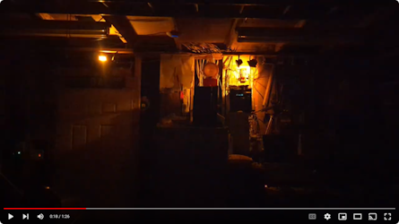
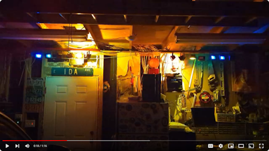
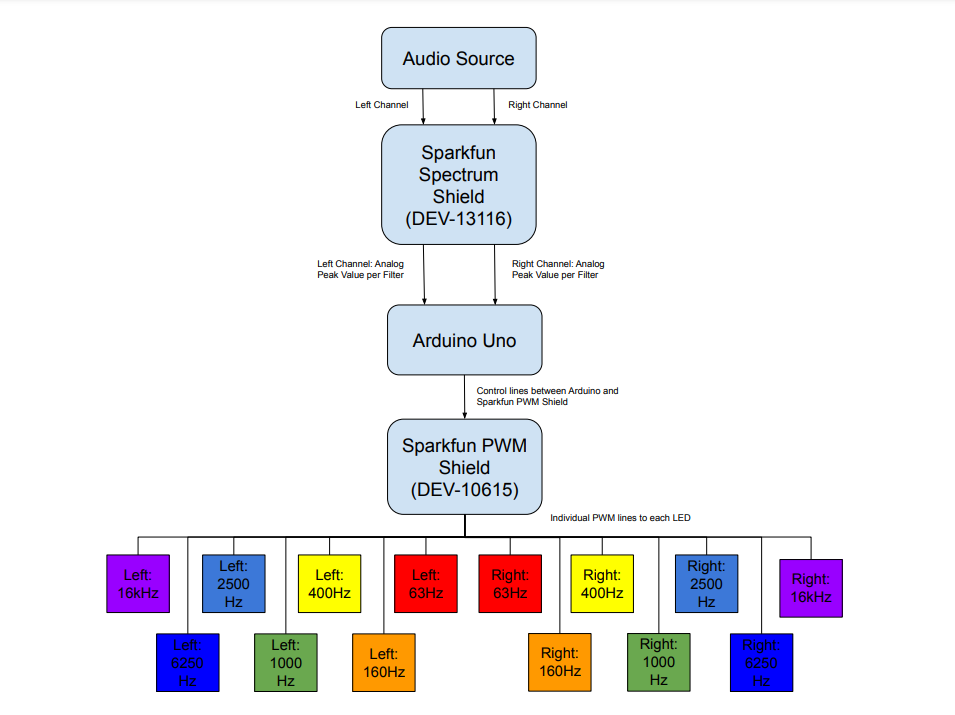

# Color Organ Project
A color organ is a device that filters an audio signal into various frequency bands and the intesity of the audio signal in that frequency band is used to drive the brightness of a light. The intensity of the sound and brightness of the light a directly related to each other. 

## Project Motivation and Description
The first color organ I built was in Circuits/Electronics II in college. That color organ used three analog filters implemented with OpAmps and a single, small LED for each filter. When I started designing this color ogran, I considered implementing it with OpAmps, but ultimately decided against it due to the potential complications, and decided on a digital design instead. 

## Demo Videos
 | 

## Technical Overview
This color organ filters audio signals provided by an 1/8" audio jack into seven different channels for each channel (left and right) using seven band pass filters per channel. The filters detect the peak value in that frequency band and provide that to an Arduino Uno via A to D channels. That value is "filtered" by an expoential filter that transforms the signal into a visually pleasing, exponetially changing signal. The raw audio waveform is not pleasant to look at because [the human eye perceives logarithmic differences in light intesnsity](https://psychology.stackexchange.com/questions/5408/sensitivity-of-human-eye-to-luminance). 

Here is a block diagram of my color organ:

### Hardware
- [Arduino Uno](https://www.sparkfun.com/products/11021) to sample peak voltage levels from left and right channels filters and set each corresponding LED's intensity via PWM control. 
- [Sparkfun Spectrum Shield](https://www.sparkfun.com/products/retired/10615) to filter the right and left channel with seven bandpass filters per channel. Bandpass center frequencies at: 63Hz, 160Hz, 400Hz, 1000Hz, 2500Hz, 6250Hz, and 16000Hz. 
- [Sparkfun PWM Shield](https://www.sparkfun.com/products/retired/10615) to drive the brightness of each LED.
- LED Driver Circuit (FET driven by BJT) to convert 5V PWM signal into a 12V PWM signal to drive the LEDs.
- [12VDC LED Flood Lights](https://www.amazon.com/gp/product/B008XZAPV8/ref=ppx_yo_dt_b_search_asin_title?ie=UTF8&psc=1) with photographic color filters to acheive desired color per LED. 
- 12VDC/5VDC Power Supply

### Firmware
- Initialize Spectrum Shield and PWM Shield
- In the main loop, continually do the following:
    - Read peak amplitudes for each band pass filter (Read_Frequencies())
        - Read peak values for each bandpass filter in the right and left channel.
        - Store the peak values for each filter in an array. One for the left channel and one for the right channel.
    - Set the associated LED brightness (Set_Leds())
        - Change the raw value from a range of 1024 counts to 4096 counts using the exponential filter
        - Set each LED value with this method
        - Once all LED values updated with the PWM shield, send Tlc.update() command to update new intensity values for each LED. 
  
